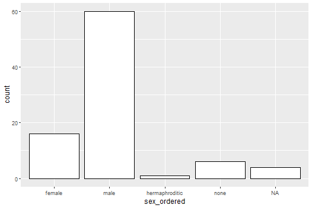
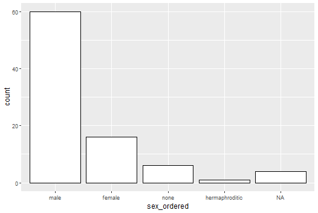
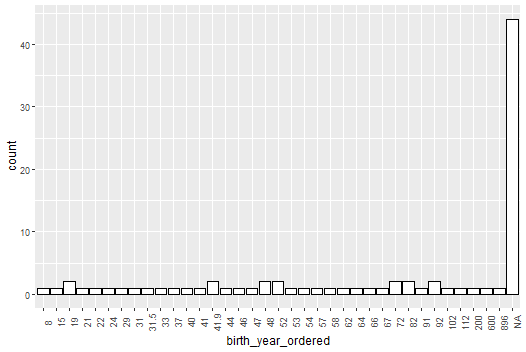
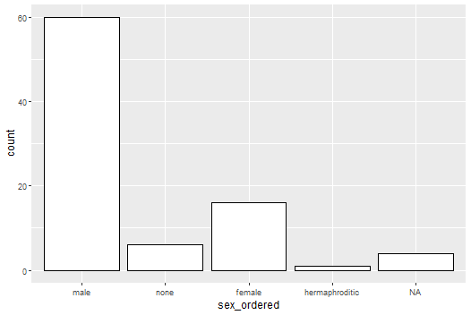
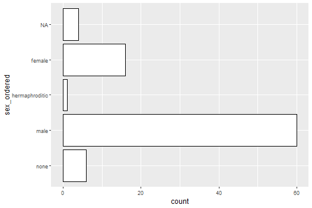

# forcats

## Overview

R uses **factors** to handle categorical variables, variables that have
a fixed and known set of possible values. Factors are also helpful for
reordering character vectors to improve display. The goal of the
**forcats** package is to provide a suite of tools that solve common
problems with factors, including changing the order of levels or the
values. Some examples include:

-   `fct_reorder()`: Reordering a factor by another variable.
-   `fct_infreq()`: Reordering a factor by the frequency of values.
-   `fct_relevel()`: Changing the order of a factor by hand.
-   `fct_lump()`: Collapsing the least/most frequent values of a factor
    into “other”.

## Installation

``` r
# to get forcats is to install the whole tidyverse:
install.packages("tidyverse")

# install just forcats:
install.packages("forcats")

# the development version from GitHub:
install.packages("devtools")
devtools::install_github("tidyverse/forcats")
```

## Cheatsheet

<a href="https://raw.githubusercontent.com/rstudio/cheatsheets/main/factors.pdf"></a>

## Usage

forcats is part of the core tidyverse, so you can load it with
`library(tidyverse)` or `library(forcats)`.

``` r
library(forcats)
library(dplyr)
library(ggplot2)
```
We will work with the starwars dataset conainted in the `dplyr` package. Below let’s have a `tibble::glimpse()` at the dataset.

``` r
starwars %>%
  glimpse()
```

Output
```
Rows: 87
Columns: 14
$ name       <chr> "Luke Skywalker", "C-3PO", "R2-D2", "Darth Vader", "Leia Or~
$ height     <int> 172, 167, 96, 202, 150, 178, 165, 97, 183, 182, 188, 180, 2~
$ mass       <dbl> 77.0, 75.0, 32.0, 136.0, 49.0, 120.0, 75.0, 32.0, 84.0, 77.~
$ hair_color <chr> "blond", NA, NA, "none", "brown", "brown, grey", "brown", N~
$ skin_color <chr> "fair", "gold", "white, blue", "white", "light", "light", "~
$ eye_color  <chr> "blue", "yellow", "red", "yellow", "brown", "blue", "blue",~
$ birth_year <dbl> 19.0, 112.0, 33.0, 41.9, 19.0, 52.0, 47.0, NA, 24.0, 57.0, ~
$ sex        <chr> "male", "none", "none", "male", "female", "male", "female",~
$ gender     <chr> "masculine", "masculine", "masculine", "masculine", "femini~
$ homeworld  <chr> "Tatooine", "Tatooine", "Naboo", "Tatooine", "Alderaan", "T~
$ species    <chr> "Human", "Droid", "Droid", "Human", "Human", "Human", "Huma~
$ films      <list> <"The Empire Strikes Back", "Revenge of the Sith", "Return~
$ vehicles   <list> <"Snowspeeder", "Imperial Speeder Bike">, <>, <>, <>, "Imp~
$ starships  <list> <"X-wing", "Imperial shuttle">, <>, <>, "TIE Advanced x1",~
```

### Factors
A factor is R’s data structure for categorical data and the forcats package provides many functions to work with them. Factors are often required when performing regression analysis in R with lm() or glm(). 

These functions need factors to handle categorical data appropriately. For example R maps the unique values of a categorical variable to individual dummy variables in order to estimate the regression model. 

Therefore it’s good to know for a start about some basic functions that handle categorical data.

### `factor()`
With `factor()` function we can create a new factor variable from scratch. First we have to input a vector `x =` of values and then a vector of `levels =`.

``` r
factor(
  x = c("1", "2", "3",
        "1", "2", "3"), 
  levels = c("1", "2", "3")
  )
```

Output
```
[1] 1 2 3 1 2 3
Levels: 1 2 3
```

### `asfactor()`
We qill take the starwars dataset and transform it with function `as.factor()` and `dplyr::mutate()` into a factor variable. Below I take the species variable and convert it to a factor. Only the storage type of the column is altered but not the values of `species`.

```r
starwars %>%
  mutate(species_fct = as.factor(species)) %>%
  select(name, starts_with("species"))
```

Output
```
# A tibble: 87 × 3
  name               species species_fct
   <chr>              <chr>   <fct>      
 1 Luke Skywalker     Human   Human      
 2 C-3PO              Droid   Droid      
 3 R2-D2              Droid   Droid      
 4 Darth Vader        Human   Human      
 5 Leia Organa        Human   Human      
 6 Owen Lars          Human   Human      
 7 Beru Whitesun lars Human   Human      
 8 R5-D4              Droid   Droid      
 9 Biggs Darklighter  Human   Human      
10 Obi-Wan Kenobi     Human   Human
```

### `lavel()`
The function levels() creates a vector of all unique values of a factor. It is important that the column on which this function is applied to is a vector and a factor. First, let us take a look what happens if we use levels() on a column that is not of type factor.

```r
starwars %>%
  pull(species) %>%
  levels()
```

output
```
NULL
```

It simply returns NULL because there are no levels attached to the column species which is originally of type character. Next we’ll try levels() on the converted species_fct column.

```r
starwars %>%
  mutate(species_fct = as.factor(species)) %>%
  pull(species_fct) %>%
  levels()
```

Output
```
 [1] "Aleena"         "Besalisk"       "Cerean"         "Chagrian"       "Clawdite"       "Droid"         
 [7] "Dug"            "Ewok"           "Geonosian"      "Gungan"         "Human"          "Hutt"          
[13] "Iktotchi"       "Kaleesh"        "Kaminoan"       "Kel Dor"        "Mirialan"       "Mon Calamari"  
[19] "Muun"           "Nautolan"       "Neimodian"      "Pau'an"         "Quermian"       "Rodian"        
[25] "Skakoan"        "Sullustan"      "Tholothian"     "Togruta"        "Toong"          "Toydarian"     
[31] "Trandoshan"     "Twi'lek"        "Vulptereen"     "Wookiee"        "Xexto"          "Yoda's species"
[37] "Zabrak" 
```

### `fct_count`
With `fct_count()` you’re able to count the number of values for each level of a factor variable. Below I apply this to the species column of the starwars dataset.

```r
fct_count(starwars$species)
```

output
```
 A tibble: 38 × 2
   f             n
   <fct>     <int>
 1 Aleena        1
 2 Besalisk      1
 3 Cerean        1
 4 Chagrian      1
 5 Clawdite      1
 6 Droid         6
 7 Dug           1
 8 Ewok          1
 9 Geonosian     1
10 Gungan        3
```

### `fct_match()`
We can check for the presence of any level in a factor with the function `fct_match()`. It simply returns `TRUE` if a level is present or `FALSE` if it is not. Let’s see whether any values of the factor `sex` display a level `"male"`.

```r
fct_match(starwars$sex, "male") %>% table()
```

Output
```
.
FALSE  TRUE 
   27    60 
```

We may also check multiple levels at once.

```r
fct_match(starwars$sex, c("male", "female")) %>% table()
```

Output
```
.
FALSE  TRUE 
   11    76 
```

### `fct_uniwue()`
The function `fct_unique()` only returns the unique values of a factor and removes duplicates.

```r
fct_unique(starwars_fct$sex)
```

Output
```
[1] female         hermaphroditic male           none          
Levels: female hermaphroditic male none
```

### `fct_c()`
With function `fct_c()` we can combine factors with different levels. Below I create two factors f1 and f2 which represent the sex and gender column of the starwars dataset. Then I use `fct_c()` to combine them.

```r
f1 <- as.factor(starwars$sex)
f2 <- as.factor(starwars$gender)
fct_c(f1, f2) %>% levels()
```

Output
```
[1] "female"         "hermaphroditic" "male"           "none"           "feminine"       "masculine"     
```

This function is best used to patch together factors from multiple sources that should have the same levels.

There is also a neat function called `fct_cross()` which computes a factor whose levels are the combinations of the levels of all input factors

```r
starwars %>%
  mutate(sex_gender = fct_cross(sex, gender)) %>%
  select(name, sex_gender, sex, gender)
```

Output
```
# A tibble: 87 × 4
   name               sex_gender      sex    gender   
   <chr>              <fct>           <chr>  <chr>    
 1 Luke Skywalker     male:masculine  male   masculine
 2 C-3PO              none:masculine  none   masculine
 3 R2-D2              none:masculine  none   masculine
 4 Darth Vader        male:masculine  male   masculine
 5 Leia Organa        female:feminine female feminine 
 6 Owen Lars          male:masculine  male   masculine
 7 Beru Whitesun lars female:feminine female feminine 
 8 R5-D4              none:masculine  none   masculine
 9 Biggs Darklighter  male:masculine  male   masculine
10 Obi-Wan Kenobi     male:masculine  male   masculine
# … with 77 more rows
```

### `fct_unify()`
For standardizing the levels across a list of factors we can use the function `fct_unify()`. 
It returns a list where each element is the initial factor augmented by the unified levels. To see only the `levels()` of each factor we have to apply a special function called `map()` from the package purrr. It applies the functions `levels()` to each list element. Read more about it here.

```r
f3 <- as.factor(starwars$eye_color)
fct_unify(list(f1, f2, f3)) %>% purrr::map(levels)
```

Output
```
[[1]]
 [1] "female"         "hermaphroditic" "male"           "none"           "feminine"       "masculine"     
 [7] "black"          "blue"           "blue-gray"      "brown"          "dark"           "gold"          
[13] "green, yellow"  "hazel"          "orange"         "pink"           "red"            "red, blue"     
[19] "unknown"        "white"          "yellow"        

[[2]]
 [1] "female"         "hermaphroditic" "male"           "none"           "feminine"       "masculine"     
 [7] "black"          "blue"           "blue-gray"      "brown"          "dark"           "gold"          
[13] "green, yellow"  "hazel"          "orange"         "pink"           "red"            "red, blue"     
[19] "unknown"        "white"          "yellow"        

[[3]]
 [1] "female"         "hermaphroditic" "male"           "none"           "feminine"       "masculine"     
 [7] "black"          "blue"           "blue-gray"      "brown"          "dark"           "gold"          
[13] "green, yellow"  "hazel"          "orange"         "pink"           "red"            "red, blue"     
[19] "unknown"        "white"          "yellow"  
```

`f1`, `f2` and `f3` now all have the same levels.

### `fct_relevel()`
With this function you can manually reorder the levels of a factor variable. We do not have to list all levels of the factor variable in fct_relevel() as the remaining levels are added alphabetically. Below I put the levels female and male in the first and second position of sex.

```r
starwars %>%
  mutate(sex_ordered = fct_relevel(sex, c("female", "male"))) %>%
  ggplot(data = ., aes(x = sex_ordered)) +
  geom_bar(stat = "count", fill = "white", color = "black")
```

Output



### `fct_infreq()`
This functions lets you reorder a factor’s levels by the frequency in which they appear in the data. The level with the highest frequeny comes first. Let’s use this function on the sex column before plotting the bar chart. Note that NA is again excluded.

```r
starwars %>%
  mutate(sex_ordered = fct_infreq(f = sex)) %>%
  ggplot(data = ., aes(x = sex_ordered)) +
  geom_bar(stat = "count", fill = "white", color = "black")
```

Output




### `fct_inseq()`
There is also a related function called fct_inseq() which is designed to work with factors whose levels display a numeric sequence. Columns of type numeric such as birth_year must always be explicitly converted to factor.

```r
starwars %>%
  mutate(birth_year_ordered = fct_inseq(as.factor(birth_year))) %>%
  ggplot(data = ., aes(x = birth_year_ordered)) +
  geom_bar(stat = "count", fill = "white", color = "black") +
  theme(axis.text.x = element_text(angle = 90))
```

Output



### `fct_inorder()`
For what it’s worth you can also reorder the levels of a factor by the order in which they are sorted in the dataset.

```r
starwars %>%
  mutate(sex_ordered = fct_inorder(sex)) %>%
  ggplot(data = ., aes(x = sex_ordered)) +
  geom_bar(stat = "count", fill = "white", color = "black")
```

Output




### `fct_rev()`
This function reverses the order the factor’s levels. This can be useful when changing the axes of a bar chart with function ggplot2::coord_flip(). When applying fct_rev() the levels of the factor appear alphabetically from the top to the bottom of the y-axis instead the other way around (as always except for NA).

```r
starwars %>%
  mutate(sex_ordered = fct_rev(f = sex)) %>%
  ggplot(data = ., aes(x = sex_ordered)) +
  geom_bar(stat = "count", fill = "white", color = "black") +
  coord_flip()
```

Output




## References

1. [r-tutorials forcats](https://rpubs.com/phle/r-tutorial-forcats)
2. [forcats](https://forcats.tidyverse.org)
3. [Functions in forcats](https://www.rdocumentation.org/packages/forcats/versions/0.0.0.9000)
