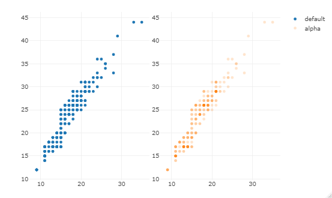
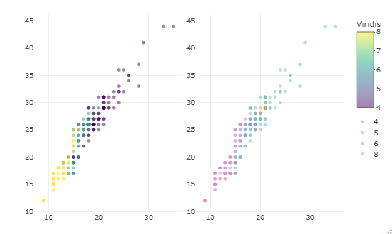
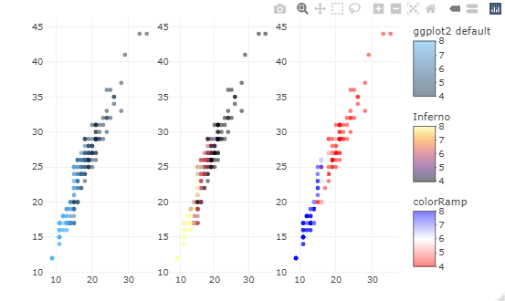
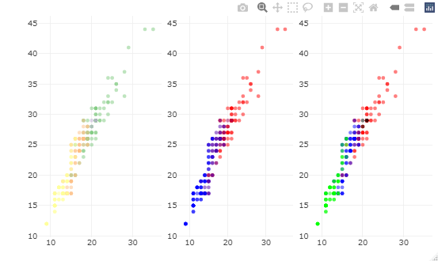
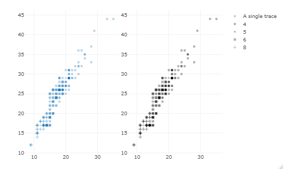
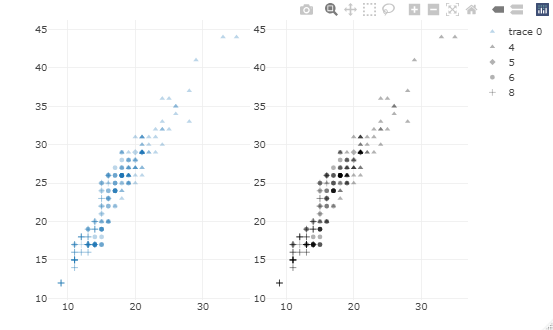
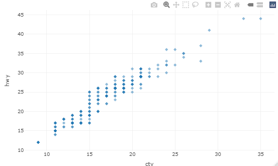
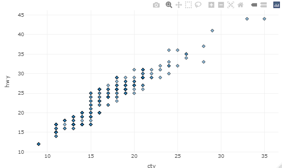
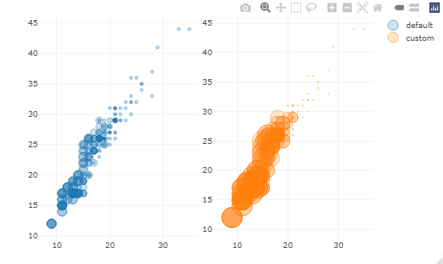
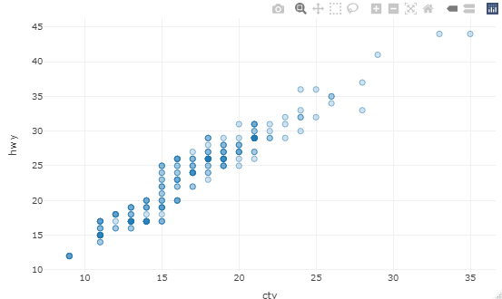

# Plotly

## Overview
Plotly in R Programming Language allows to create interactive web graphics from ‘ggplot2’ graphs and a custom interface to the JavaScript library ‘plotly.js’ inspired by the grammar of graphics.

## Installation

Install from CRAN:
```r
install.packages("plotly")
```

Or install the latest development version (on GitHub) via {remotes}:
```r
remotes::install_github("plotly/plotly")
```

## Important Functions

### `plot_ly`: 
It basically initiates a plotly visualization. This function maps R objects to plotly.js, an (MIT licensed) web-based interactive charting library. It provides abstractions for doing common things and sets some different defaults to make the interface feel more ‘R-like’ (i.e., closer to plot() and `ggplot2::qplot())`.

```r
# import plotly library
library(plotly)

# create plotly visualisation
p <- plot_ly(iris, x = ~Sepal.Width,
				y = ~Sepal.Length)

# adding markers
add_markers(p, color = ~Petal.Length,
			size = ~Petal.Length)
add_markers(p, color = ~Species)
```

Output :


### `add_trace`: 
Add trace(s) to a plotly visualization.

```r
# import plotly library
library(plotly)

# create plotly visualisation
p <- plot_ly(iris, x = ~Sepal.Width,
					y = ~Sepal.Length)

# adding trace (lines) to plotly
# visualisation
add_trace(p, type = "scatter",
		mode = "markers+lines")
```

Output :


### `animation_opts`: 
Provides animation configuration options. Animations can be created by either using the frame argument in `plot_ly()` or frame ggplot2 aesthetic in `ggplotly()`. By default, animations populate a play button and slider component for controlling the state of the animation (to pause an animation, click on a relevant location on the slider bar). Both the play button and slider component transition between frames according to rules specified by `animation_opts()`.

```r
# import plotly library
library(plotly)

plot_ly(mtcars, x = ~wt, y = ~mpg,
		frame = ~cyl) %>%
animation_opts(transition = 0)
```

Output:


### `add_data`: 
Add data to a plotly visualization.

```r
# import plotly library
library(plotly)

plot_ly() %>% add_data(economics) %>%
		add_trace(x = ~date, y = ~pce)
```

Output:


### `plotly_IMAGE`: 
Creates a static image for plotly visualization. The images endpoint turns a plot (which may be given in multiple forms) into an image of the desired format.

```r
# import plotly library
library(plotly)

# create plotly visualisation
p <- plot_ly(iris, x = ~Sepal.Width,
					y = ~Sepal.Length)

# importing plotly visualisation
# as image files
Png <- plotly_IMAGE(p,
					out_file = "plotly-test-image.png")
Jpeg <- plotly_IMAGE(p, format = "jpeg",
					out_file = "plotly-test-image.jpeg")

# importing plotly visualisation
# as vector graphics
Svg <- plotly_IMAGE(p, format = "svg",
					out_file = "plotly-test-image.svg")

# importing plotly visualisation as
# pdf file
Pdf <- plotly_IMAGE(p, format = "pdf",
					out_file = "plotly-test-image.pdf")
```

Output:


## Markers

### Alpha Blending

```r
subplot(
  plot_ly(mpg, x = ~cty, y = ~hwy, name = "default"),
  plot_ly(mpg, x = ~cty, y = ~hwy) %>% 
    add_markers(alpha = 0.2, name = "alpha")
)
```

Output :



### Colors
The `colorbar()` function can be used to customize the appearance of this automatically generated guide. The default colorscale is viridis, a perceptually-uniform colorscale (even when converted to black-and-white), and perceivable even to those with common forms of color blindness.

#### Variations on a numeric color mapping
```r
p <- plot_ly(mpg, x = ~cty, y = ~hwy, alpha = 0.5)
subplot(
  add_markers(p, color = ~cyl, showlegend = FALSE) %>% 
    colorbar(title = "Viridis"),
  add_markers(p, color = ~factor(cyl))
)
```

Output :



There are numerous ways to alter the default color scale via the colors argument. This argument excepts one of the following: (1) a color brewer palette name (see the row names of RColorBrewer::brewer.pal.info for valid names), (2) a vector of colors to interpolate, or (3) a color interpolation function like colorRamp() or scales::colour_ramp(). 

#### Three variations on a numeric color mapping.
```r
col1 <- c("#132B43", "#56B1F7")
col2 <- viridisLite::inferno(10)
col3 <- colorRamp(c("red", "white", "blue"))
subplot(
  add_markers(p, color = ~cyl, colors = col1) %>%
    colorbar(title = "ggplot2 default"),
  add_markers(p, color = ~cyl, colors = col2) %>% 
    colorbar(title = "Inferno"),
  add_markers(p, color = ~cyl, colors = col3) %>% 
    colorbar(title = "colorRamp")
) %>% hide_legend()
```

Output :



#### Three variations on a discrete color mapping.
```r
col1 <- "Accent"
col2 <- colorRamp(c("red", "blue"))
col3 <- c(`4` = "red", `5` = "black", `6` = "blue", `8` = "green")
subplot(
  add_markers(p, color = ~factor(cyl), colors = col1),
  add_markers(p, color = ~factor(cyl), colors = col2),
  add_markers(p, color = ~factor(cyl), colors = col3)
) %>% hide_legend()
```

Output :



### Symbols
The symbol argument can be used to map data values to the marker.symbol plotly.js attribute. It uses the same semantics that we’ve already seen for color:

- A numeric mapping generates trace.
- A discrete mapping generates multiple traces (one trace per category).
- The plural, symbols, can be used to specify the visual range for the mapping.
- Mappings are avoided entirely through I().

#### Mapping symbol to a numeric variable (left panel) and a factor (right panel).

```r
p <- plot_ly(mpg, x = ~cty, y = ~hwy, alpha = 0.3) 
subplot(
  add_markers(p, symbol = ~cyl, name = "A single trace"),
  add_markers(p, symbol = ~factor(cyl), color = I("black"))
)
```

Output :



#### Specifying the visual range of `symbols`.

```r
subplot(
  add_markers(p, symbol = ~cyl, symbols = c(17, 18, 19)),
  add_markers(
    p, color = I("black"),
    symbol = ~factor(cyl), 
    symbols = c("triangle-up", "diamond", "circle")
  )
)
```

Output :



#### Setting a fixed symbol directly using `I()`

```r
plot_ly(mpg, x = ~cty, y = ~hwy) %>%
  add_markers(symbol = I(18), alpha = 0.5)
```

Output :



## Stroke and span
The `stroke` argument follows the same semantics as `color` and `symbol` when it comes to variable mappings and specifying visual ranges. Using stroke and span to control the outline color as well as the width of that outline.

```r
plot_ly(mpg, x = ~cty, y = ~hwy, alpha = 0.5) %>%
  add_markers(symbol = I(18), stroke = I("black"), span = I(1))
```

Output :



### Size
The `size` argument controls the area of markers (unless otherwise specified via sizemode), and must be a numeric variable. The `sizes` argument controls the minimum and maximum size of circles, in pixels:

```r
p <- plot_ly(mpg, x = ~cty, y = ~hwy, alpha = 0.3) 
subplot(
  add_markers(p, size = ~cyl, name = "default"),
  add_markers(p, size = ~cyl, sizes = c(1, 500), name = "custom")
)
```

Output :



arguments `I()` can be used to specify the size directly. In the case of markers, `size` controls the `marker.size` plotly.js attribute.

```r
plot_ly(mpg, x = ~cty, y = ~hwy, alpha = 0.3, size = I(30))
```

Output :




## References:

1. [Github](https://github.com/plotly/plotly.R)
2. [Interactive web-based data visualization with R, plotly, and shiny](https://plotly-r.com/index.html)
3. [Getting Started with Plotly in R](https://www.geeksforgeeks.org/getting-started-with-plotly-in-r/)
