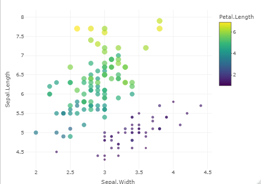
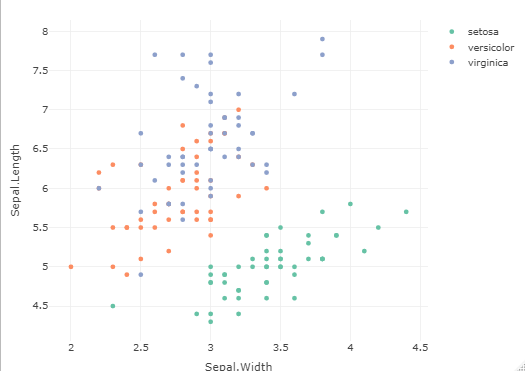
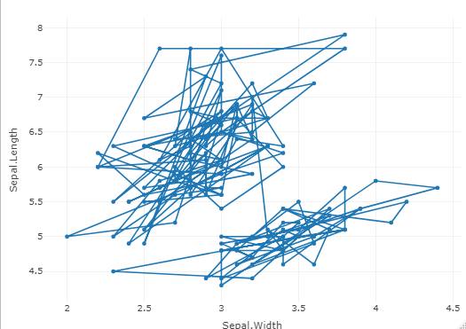
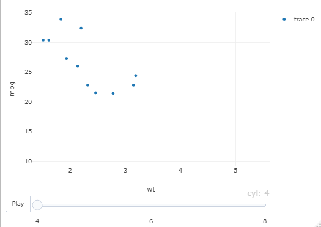
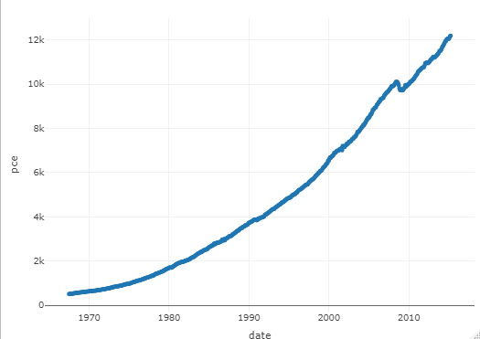
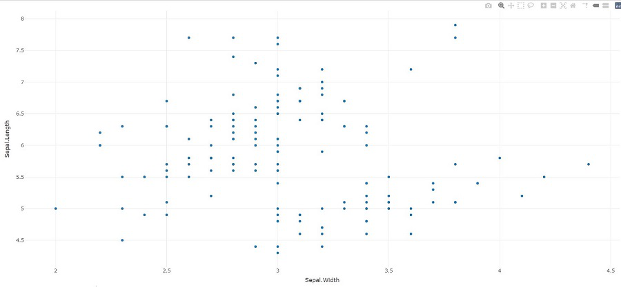

# Plotly

## Overview
Plotly in R Programming Language allows to create interactive web graphics from ‘ggplot2’ graphs and a custom interface to the JavaScript library ‘plotly.js’ inspired by the grammar of graphics.

## Installation

Install from CRAN:
```r
install.packages("plotly")
```

Or install the latest development version (on GitHub) via {remotes}:
```r
remotes::install_github("plotly/plotly")
```

## Important Functions

### `plot_ly`: 
It basically initiates a plotly visualization. This function maps R objects to plotly.js, an (MIT licensed) web-based interactive charting library. It provides abstractions for doing common things and sets some different defaults to make the interface feel more ‘R-like’ (i.e., closer to plot() and `ggplot2::qplot())`.

```r
# import plotly library
library(plotly)

# create plotly visualisation
p <- plot_ly(iris, x = ~Sepal.Width,
				y = ~Sepal.Length)

# adding markers
add_markers(p, color = ~Petal.Length,
			size = ~Petal.Length)
add_markers(p, color = ~Species)
```

Output :






### `add_trace`: 
Add trace(s) to a plotly visualization.

```r
# import plotly library
library(plotly)

# create plotly visualisation
p <- plot_ly(iris, x = ~Sepal.Width,
					y = ~Sepal.Length)

# adding trace (lines) to plotly
# visualisation
add_trace(p, type = "scatter",
		mode = "markers+lines")
```

Output :



### `animation_opts`: 
Provides animation configuration options. Animations can be created by either using the frame argument in `plot_ly()` or frame ggplot2 aesthetic in `ggplotly()`. By default, animations populate a play button and slider component for controlling the state of the animation (to pause an animation, click on a relevant location on the slider bar). Both the play button and slider component transition between frames according to rules specified by `animation_opts()`.

```r
# import plotly library
library(plotly)

plot_ly(mtcars, x = ~wt, y = ~mpg,
		frame = ~cyl) %>%
animation_opts(transition = 0)
```

Output:



### `add_data`: 
Add data to a plotly visualization.

```r
# import plotly library
library(plotly)

plot_ly() %>% add_data(economics) %>%
		add_trace(x = ~date, y = ~pce)
```

Output:



### `plotly_IMAGE`: 
Creates a static image for plotly visualization. The images endpoint turns a plot (which may be given in multiple forms) into an image of the desired format.

```r
# import plotly library
library(plotly)

# create plotly visualisation
p <- plot_ly(iris, x = ~Sepal.Width,
					y = ~Sepal.Length)

# importing plotly visualisation
# as image files
Png <- plotly_IMAGE(p,
					out_file = "plotly-test-image.png")
Jpeg <- plotly_IMAGE(p, format = "jpeg",
					out_file = "plotly-test-image.jpeg")

# importing plotly visualisation
# as vector graphics
Svg <- plotly_IMAGE(p, format = "svg",
					out_file = "plotly-test-image.svg")

# importing plotly visualisation as
# pdf file
Pdf <- plotly_IMAGE(p, format = "pdf",
					out_file = "plotly-test-image.pdf")
```

Output:




## References:

1. [Github](https://github.com/plotly/plotly.R)
2. [Interactive web-based data visualization with R, plotly, and shiny](https://plotly-r.com/index.html)
3. [Getting Started with Plotly in R](https://www.geeksforgeeks.org/getting-started-with-plotly-in-r/)
